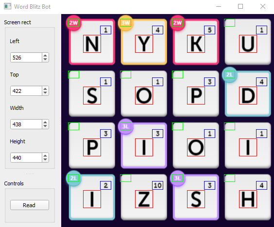

# Word Blitz Bot
Can automatically solve a word blitz game. To run the program execute the following command.

```
python3 run_bot.py
```
Press read to create the word matrix. If there are an incorrect characters, fix these up.
Then press solve to automatically solve Word Blitz. For the time being, the only way to stop the program
is to CTRL-ALT-DELETE.

## Completed
* Autoclicking and dragging
* Basic UI
* Solver for word matrix
* Parser for converting list of dictionary words into a tree
* Cropping for all characters
* Optimization to solve higher value words
  * Detect if there is a bonus
  * Start off with longest words

## Todo
* ~~Implement custom deep neural nets to process the image~~
  * ~~Tesseract OCR takes a long time for each image (250ms)~~
  * ~~Tesseract OCR has a low accuracy~~
* ~~Use separate models for each of the types of boxes~~
  * ~~Main characters in the tiles (centre)~~
  * ~~Value of the letter (top right)~~
  * ~~Bonus associated with tile (top left)~~
* Implement a kill switch to toggle the bot
* Decrease loading times (mainly constructing the word tree)
  * Remove invalid words
  * ~~Convert to a faster to load format (store as hashmap with branches)~~
* Add learning where invalid words are pruned from word tree, and missing words are added
  * Invalid words can be detected from the game (lack of +score indicator above grid)
  * Missing valid words have to be manually added from the post game screen

## Demonstration
[](http://www.youtube.com/watch?v=SgWCdYiSb5Q "Demonstration")

## Gallery



