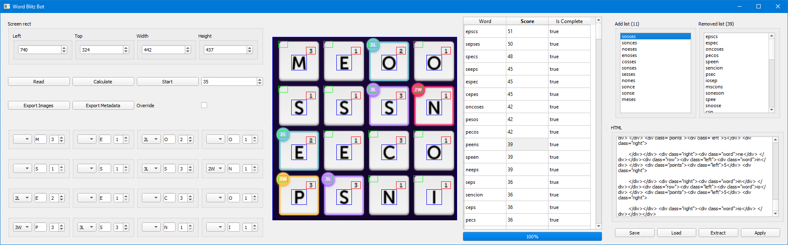

# Word Blitz Bot
Can automatically solve a word blitz game. To run the program execute the following command.

```
python3 run_bot.py
```
Press the following buttons:
1. Read - Image recognition to read in matrix
2. Calculate - Calculate all the best word combinations and their exact score
3. Start - Begin execution of all words (User cannot do anything during this)

For the time being, the only way to stop the program is to CTRL-ALT-DELETE.

## Completed
* Autoclicking and dragging
* Automatically reads all information on screen
* Basic UI
* Finds best possible path for each word and shows them in a list
* Fast loading time for the dictionary
* Fast character/digit recognition using machine learning
* HTML parser to extract missed words and invalid words

## TODO
* Keep perfecting the dictionary
* Freeze the tensorflow models for faster loading

## Old demonstration video
[](http://www.youtube.com/watch?v=SgWCdYiSb5Q "Old Demonstration")

## Gallery



